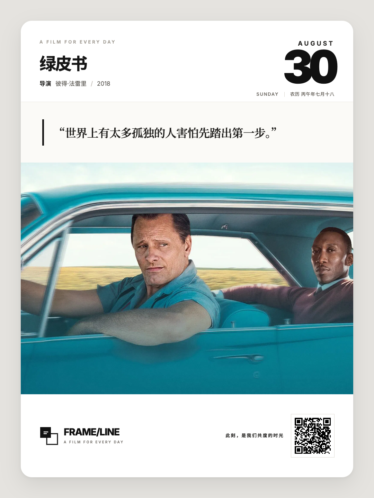
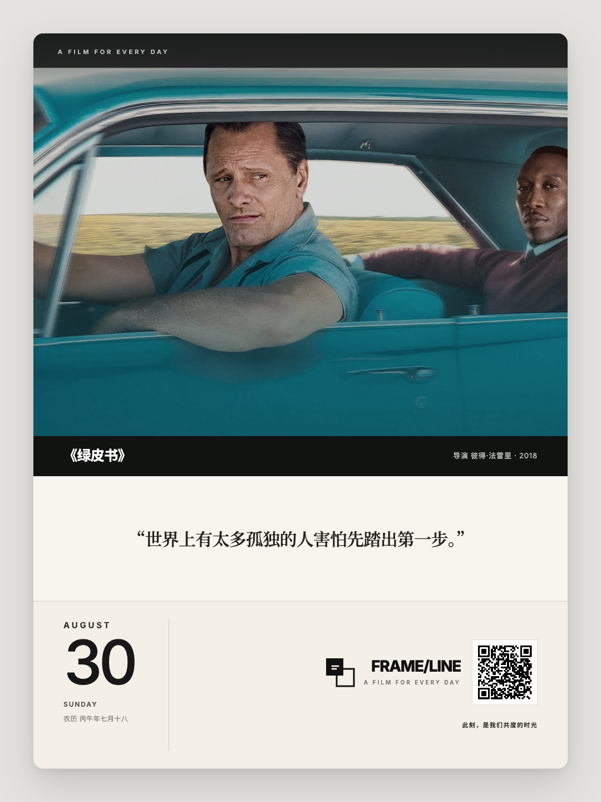

# Frame Line 2

每日一部电影：从 Hitokoto 影视金句中按日期选句，根据金句的影片出处匹配 TMDB 电影，再使用 `poster-ai` 生成 1080 × 1440 电影日签。

本仓库只包含日签应用实现。[Michaelliv/poster](https://github.com/Michaelliv/poster) 作为依赖使用，不包含其源码。该项目在 GitHub 上名为 `poster`，发布到 npm 的包名是 `poster-ai`，安装后提供的 CLI 命令是 `poster`；三者是同一个项目。

## 版式预览

两张效果图均使用默认品牌、默认矢量 Logo 和自动二维码生成。

### Editorial

`appearance.layout: "editorial"`



### Cinema

`appearance.layout: "cinema"`



## 安装

```bash
npm install
cp .env.example .env
cp config.json.example config.json
```

在 `.env` 中填写：

```dotenv
TMDB_READ_ACCESS_TOKEN=
TMDB_API_KEY=
OMDB_API_KEY=
```

TMDB Token 与 API Key 任选其一；OMDb 用于补充校验导演和年份。

## 配置

`config.json` 控制背景、左上角 slogan、左下角 Logo、右下角 slogan 与二维码：

```json
{
  "appearance": {
    "grayBackground": true,
    "layout": "editorial"
  },
  "header": {
    "slogan": "电影的美好"
  },
  "brand": {
    "name": "FRAME/LINE",
    "tagline": "A FILM FOR EVERY DAY",
    "logo": ""
  },
  "qr": {
    "target": "",
    "image": "",
    "monochrome": true,
    "slogan": "此刻，是我们共度的时光",
    "description": []
  }
}
```

- `appearance.grayBackground`: `true` 为浅灰背景；`false` 为透明背景。
- `appearance.layout`: `editorial` 为原有杂志卡片版式；`cinema` 为上图下文的观影版式。
- `brand.logo`: 本地文件、HTTP(S) URL 或 data URL；文件不存在时使用内置默认 Logo。
- `qr.target`: 自动生成二维码的内容；为空时使用当天电影的 TMDB 页面。
- `qr.image`: 直接使用二维码图片；为空时自动生成。
- `qr.monochrome`: 将指定二维码无损显示为黑色。

本地 Logo、二维码统一放在 `assets/`。`assets/`、`config.json`、`.env`、生成数据与成品均已忽略，不会进入 Git。

## 一条命令生成

`scripts/daily.mjs` 在一个 Node.js 进程内完成取金句、匹配电影、写入数据、生成 HTML 和导出 PNG：

```bash
npm run daily
```

指定日期：

```bash
npm run daily -- --date 2026-08-29
```

无 API Key 时运行演示：

```bash
npm run daily -- --demo --date 2026-08-29
```

输出：

- `output/daily-movie.html`
- `output/daily-movie.png`

## 分步执行

```bash
npm run generate
npm run build
npm run export
```

仅生成固定演示数据：

```bash
npm run demo
```

## 测试

```bash
npm test
```
